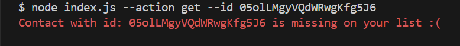
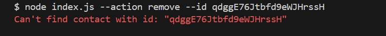

# goit-node-hw-01

"Contacts" CLI app

## DEMO

`node index.js --action list`

.png> "list(1)")
.png> "list(2)")

`node index.js --action get`

.png> "get(2)")

`node index.js --action add`

.png> "add(1)")
.png> "add(2)")

`node index.js --action remove`

## Technologies used

- Node
- JavaScript

## Setup and Usage

Clone this repo to your desktop and run `npm install` to install all the
dependencies. Once the dependencies are installed, you can run:

- list : node index.js --action list
- find by id : node index.js --action get --id CONTACT_ID
- add : node index.js --action add --name NAME --email EXAMPLE@EMAIL.COM --phone 322-22-22
- remove : node index.js --action remove --id CONTACT_ID
